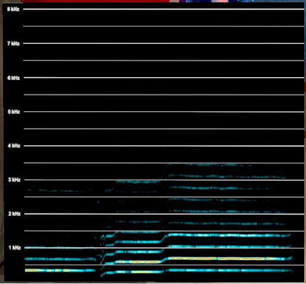
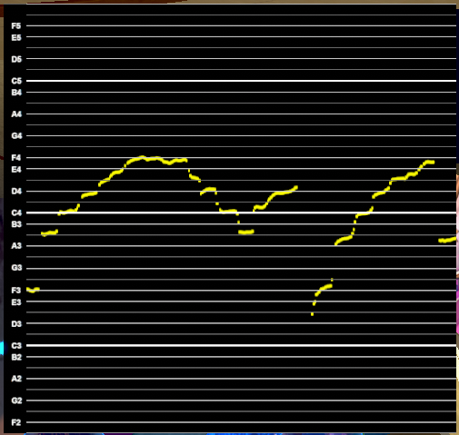
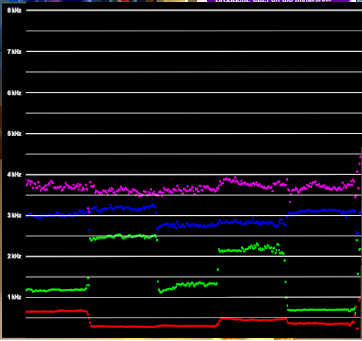
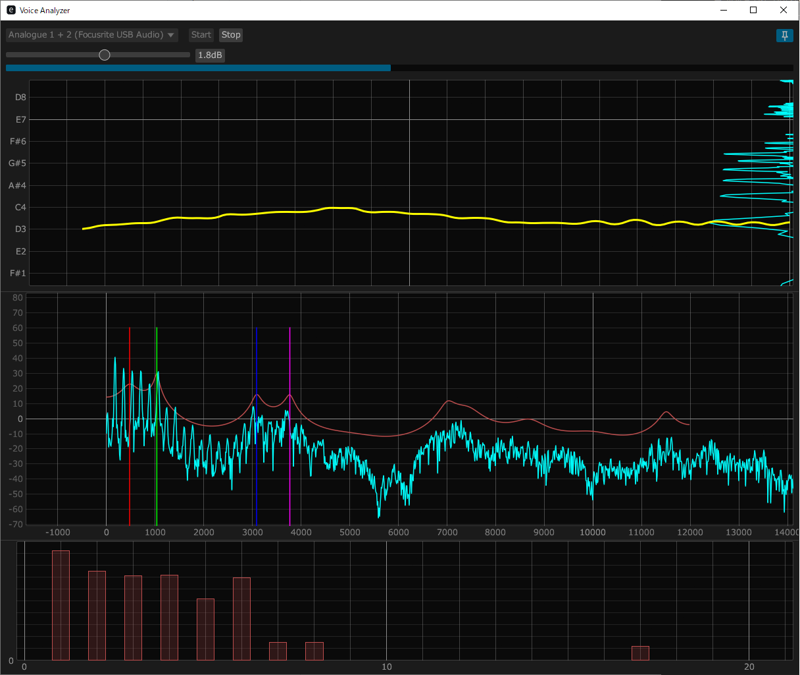

# VoiceAnalyzer

## 概要

VRChat 上でグローバルに動作する音声解析ツール（アバターギミック）です。主な機能は下記の 3 点です。

- サウンドスペクトログラム (Spectrogram)
  - 基音とその整数次倍音のゲインをヒートマップで表示します
  - 0 Hz から 8192 Hz を表示します
  - デフォルトでは 10 倍音まで表示します
  - カスタムで 20 倍音まで表示を拡張可能です（詳細は後述します）
  - デフォルトで expression parameter を 83 bits 消費します（20 倍音まで表示する場合は 163 bits 消費します）

  

- ピッチモニター (PitchMonitor)
  - 基音のピッチを表示します
  - E2 から G5 を表示します
  - expression parameter を 27 bits 消費します

  

- フォルマントモニター (FormantMonitor)
  - 第一フォルマントから第四フォルマントを表示します
  - 0 Hz から 8192 Hz を表示します
  - expression parameter を 67 bits 消費します

  

- OSC アプリ (voice_analyzer.exe)
  - 機能・仕様
    - 音声入力・音声解析・OSC 送信を行います
    - start を押してからは stop が押されるまで音声入力・音声解析・OSC 送信が行われ続けます
    - 上部のスライダーで入力ボリュームを調整できます
    - グラフは上からピッチ表示・スペクトル表示・整数次倍音のゲイン表示です
    - ピッチ表示の右側にもスペクトルを表示しています
    - スペクトル表示に重ねて描画される、左から赤・緑・青・ピンクの縦線は、順に第一フォルマント周波数・第二フォルマント周波数・第三フォルマント周波数・第四フォルマント周波数を表しています
    - voice_analyzer.exe がフォーカスから外れた際、パフォーマンス向上のためグラフの表示を省略します
      - 右上のピンマークでグラフの常時表示に切り替え可能です
      - OSC アプリのウィンドウを小さくしすぎるとピンマークの表示がおかしくなる可能性があります
  - ユーザーができること
    - 入力デバイス選択
    - start / stop の切り替え
    - 入力ボリューム調整
    - グラフを常時表示するかの切り替え（右上のピンマーク）
    - 各グラフの表示領域の拡大・縮小
    - 各グラフの縦軸・横軸の拡大・縮小

  

## 開発環境

- Unity version 2022.3.22f1
- VRChat SDK - Base 3.7.6
- VRChat SDK - Avatars 3.7.6
- Modular Avatar 1.13.0

## 導入方法

VoiceAnalyzer を使用するためには **アセットが組み込まれたアバターのアップロード** と、**OSC アプリの実行** が必要です。

### アセットが組み込まれたアバターのアップロード

1. VoiceAnalyzer.unitypackage をアバターのプロジェクトにインポートしてください
2. 使用したい機能に対応した prefab をアバター直下に配置してください

Modular Avatar に対応しているため、上記操作ののちアップロードするだけで動作するはずです。

### OSC アプリの実行

1. VoiceAnalyzer を使用したいタイミングで voice_analyzer.exe を実行してください
2. 音声入力に使いたいマイクを選択してください
3. Start ボタンを押してから、グラフを表示して音声が入ってることを確認してください
4. グラフ描画を切っても Stop ボタンが押されるまでは常に音声解析結果が OSC で送信されています

### VRChat 上での操作方法

Expression Menu に配置した prefab に応じた SubMenu が追加されているはずです。  
使いたい機能の **Enable + Scroll ON** を ON にしていただくと表示用 Quad の更新が行われます。

- Expression Menu に配置した prefab に応じた SubMenu が追加されます
- 各 SubMenu には下記の toggle が登録されています
  - Enable
    - false (default) : 表示用 Quad が非表示になります
    - true : 表示用 Quad が表示されます
  - Scroll ON
    - false (default) : 表示用 Quad の画面更新が無効化されます（画面の一時停止にも利用可能です）
    - true : 表示用 Quad の画面更新が有効かされます
  - FixPosition
    - false (default) : 表示用 Quad が導入したアバターの head ボーンに追従します
    - true : 表示用 Quad がワールド座標に固定されます

## 注意事項

- 全ての機能をまるっと含めると expression parameter が不足する可能性があるのでお気をつけください
  - Spectrogram, PitchMonitor, FormantMonitor の 3 つを含めるとデフォルトで 169 bits 消費します
- 本アセットおよび付属の OSC アプリは、無保証で提供されています。使用に際して発生したいかなる損害・不具合についても、開発者は一切の責任を負いません。使用はすべて自己責任でお願いいたします。

## その他

- スペクトログラムの表示倍音を増やす（減らす）方法
  - Spectrogram の MA parameters にある未登録パラメータのタブから *G~~* (ex. G10, G11) のパラメータを増やしたり減らしたりしてください
  - *G~~* のパラメータを追加した際に名前の右にあるタブが "Animatorのみ" になる場合、"Float" に変更してください

## 謝辞

[@naca-nyan](https://github.com/naca-nyan) が OSC アプリの Rust 実装をしてくれました。ありがとうございます。